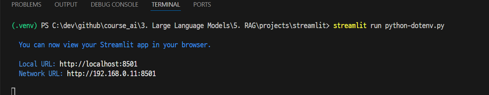
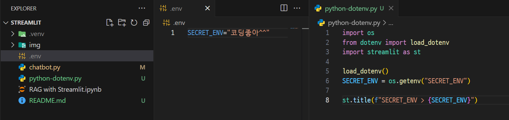
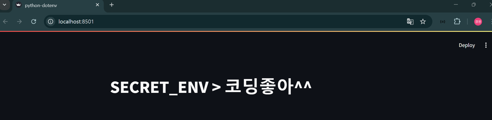
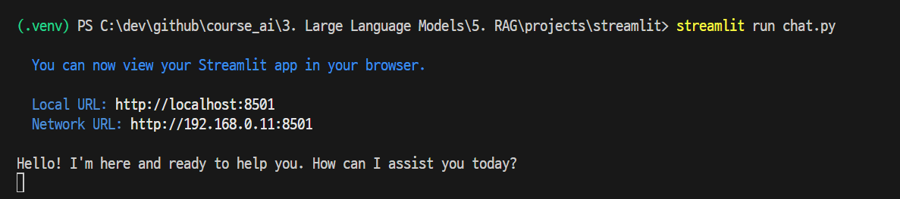
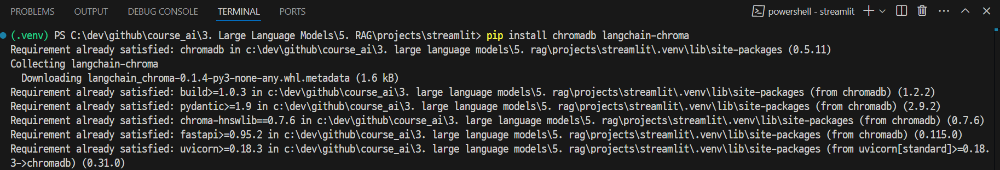
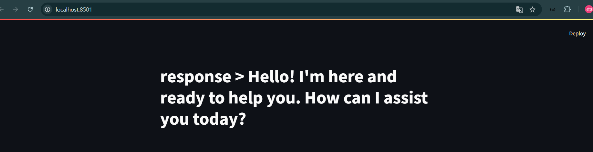

# chatbot.py

---
## [python-dotenv](https://daco2020.tistory.com/480)
- Python에서는 python-dotenv 라이브러리를 사용하여 환경변수를 쉽게 관리할 수 있다.

---
### 단계1: 설치
```shell
pip install python-dotenv
```
### 단계2: `.env`
- `.env` 파일에 환경변수 설정 
```shell
USER_NAME="홍길동"
```

---
### 단계3: 사용법
```python
import os
from dotenv import load_dotenv

# .env에 등록된 데이터를 os 환경변수에 적용
load_dotenv()

# os 환경변수에 등록된 데이터 확인 
SECRET_ENV = os.getenv("SECRET_ENV")
```

---
## [streamlit chatbot](https://docs.streamlit.io/develop/tutorials/llms/build-conversational-apps) 
- streamlit을 이용하여 chatbot 구축 

### 단계1: 설치
```shell
pip install streamlit
```
---
### 단계2: chat_input
- 사용자가 chat을 입력하는 widget
```python
import streamlit as st

prompt = st.chat_input("Say something")
if prompt:
    st.write(f"User has sent the following prompt: {prompt}")
```

---
### 단계3: chat_message
- 사용자의 chat과 응답을 보여줌
```python
import streamlit as st

with st.chat_message("user"):
    st.write("Hello 👋")
```

---
### 단계4: session_state 
- chat history를 저장
```python
import streamlit as st

st.title("Echo Bot")

# Initialize chat history
if "messages" not in st.session_state:
    st.session_state.messages = []

# Display chat messages from history on app rerun
for message in st.session_state.messages:
    with st.chat_message(message["role"]):
        st.markdown(message["content"])
```

---
### 단계5: 실행
```shell
streamlit run chatbot.py
```


---
# [chatbot_with_openai.py](https://platform.openai.com/docs/api-reference/chat)

---
### 단계1: 설치
```shell
pip install openai
```
### 단계2: `.env`
- `.env` 파일에 환경변수 설정 
```shell
OPENAI_API_KEY="openai api key 입력"
```

---
### [단계3: Caching by Streamlit](https://docs.streamlit.io/develop/concepts/architecture/caching#caching-overview) 
- 캐싱은 데이터를 일시적으로 고속 데이터 저장 계층인 캐시에 저장하는 기술입니다. 
- 캐싱의 주요 목적은 기존의 느린 저장 계층에 접근할 필요 없이 데이터 검색 속도를 높이는 데 있습니다. 
- 데이터가 요청되면 시스템은 먼저 캐시를 확인합니다. 데이터가 발견되면 즉시 반환됩니다. 
- 그렇지 않으면 시스템은 데이터를 원래 저장소에서 가져오고 반환한 후 미래의 요청을 위해 캐시에 저장합니다.

---
#### Streamlit Cache 장점
- `성능 향상`: 캐시에 비싼 함수 호출 결과를 저장함으로써 Streamlit 앱의 속도를 대폭 높일 수 있습니다. 특히 대용량 데이터셋이나 복잡한 기계 학습 모델과 함께 작업할 때 데이터 로드 또는 계산에 오랜 시간이 걸리는 경우에 이점이 큽니다.
- `효율성 증대`: 캐싱을 통해 불필요한 계산을 피할 수 있습니다. 함수가 이전과 같은 인수로 이전에 호출된 경우, Streamlit은 함수의 결과를 다시 계산하는 대신 캐시에서 결과를 검색할 수 있습니다.
- `사용자 경험 향상`: 로드 시간이 더 빠르고 반응성이 높은 앱은 더 좋은 사용자 경험을 제공합니다. 캐싱을 사용하면 사용자는 앱과 상호작용할 때마다 데이터가 로드되거나 계산이 완료될 때까지 기다릴 필요가 없습니다.

---
#### st.cache_data
```python
@st.cache_data  # 👈 Add the caching decorator
def load_data(url):
    df = pd.read_csv(url)
    return df

df = load_data("https://github.com/plotly/datasets/raw/master/uber-rides-data1.csv")
st.dataframe(df)

st.button("Rerun")
```

---
#### st.cache_resource
```python
from transformers import pipeline

@st.cache_resource  # 👈 Add the caching decorator
def load_model():
    return pipeline("sentiment-analysis")

model = load_model()

query = st.text_input("Your query", value="I love Streamlit! 🎈")
if query:
    result = model(query)[0]  # 👈 Classify the query text
    st.write(result)
```

---
### 단계4: OpenAI Chat 생성
```python
import streamlit as st
from openai import OpenAI

@st.cache_resource
def get_client_of_openai():
    return OpenAI()

client = get_client_of_openai()

stream = client.chat.completions.create(
    model="gpt-4o-mini",
    messages=[{"role": "user", "content": "Say this is a test"}],
    stream=True,
)
for chunk in stream:
    if chunk.choices[0].delta.content is not None:
        print(chunk.choices[0].delta.content, end="")
```

---
### 단계5: 실행 
```shell
streamlit run chatbot_with_openai.py
```


---
# [chatbot_with_rag.py](https://github.com/cailynyongyong/solar-llm/blob/master/chatbot.py)
- https://alphalog.co.kr/227
- https://gniogolb.tistory.com/17
- https://wikidocs.net/230759

---
## Install Chroma Vector DB
- [Install Chroma on Window 에러](https://stackoverflow.com/questions/73969269/error-could-not-build-wheels-for-hnswlib-which-is-required-to-install-pyprojec/76245995#76245995)

---
### [단계1: Microsoft C++ Build Tools 다운로드](https://visualstudio.microsoft.com/ko/visual-cpp-build-tools/)


---
### 단계2: Microsoft C++ Build Tools 실행 및 설치


---
### 단계3: install Chroma 
```shell
pip install chromadb langchain-chroma
```


---
## RAG(Retrieval-Augmented Generation)


---


