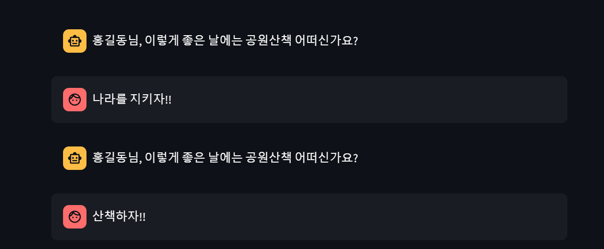

# chatbot.py

---
## [python-dotenv](https://daco2020.tistory.com/480)
- Python에서는 python-dotenv 라이브러리를 사용하여 환경변수를 쉽게 관리할 수 있다.

---
### 단계1: 설치
```shell
pip install python-dotenv
```
### 단계2: `.env`
- `.env` 파일에 환경변수 설정 
```shell
USER_NAME="홍길동"
```

---
### 단계3: 사용법
```python
import os
from dotenv import load_dotenv

# .env에 등록된 데이터를 os 환경변수에 적용
load_dotenv()

# os 환경변수에 등록된 데이터 확인 
SECRET_ENV = os.getenv("SECRET_ENV")
```

---
## [streamlit chatbot](https://docs.streamlit.io/develop/tutorials/llms/build-conversational-apps) 
- streamlit을 이용하여 chatbot 구축 

### 단계1: 설치
```shell
pip install streamlit
```
---
### 단계2: chat_input
- 사용자가 chat을 입력하는 widget
```python
import streamlit as st

prompt = st.chat_input("Say something")
if prompt:
    st.write(f"User has sent the following prompt: {prompt}")
```

---
### 단계3: chat_message
- 사용자의 chat과 응답을 보여줌
```python
import streamlit as st

with st.chat_message("user"):
    st.write("Hello 👋")
```

---
### 단계4: session_state 
- chat history를 저장
```python
import streamlit as st

st.title("Echo Bot")

# Initialize chat history
if "messages" not in st.session_state:
    st.session_state.messages = []

# Display chat messages from history on app rerun
for message in st.session_state.messages:
    with st.chat_message(message["role"]):
        st.markdown(message["content"])
```

---
### 단계5: 실행
```shell
streamlit run chatbot.py
```


---
# [chatbot_with_openai.py](https://platform.openai.com/docs/api-reference/chat)

---
### 단계1: 설치
```shell
pip install openai
```
### 단계2: `.env`
- `.env` 파일에 환경변수 설정 
```shell
OPENAI_API_KEY="openai api key 입력"
```

---
### 단계3: OpenAI Chat 생성
```python
from openai import OpenAI

client = OpenAI()

stream = client.chat.completions.create(
    model="gpt-4o-mini",
    messages=[{"role": "user", "content": "Say this is a test"}],
    stream=True,
)
for chunk in stream:
    if chunk.choices[0].delta.content is not None:
        print(chunk.choices[0].delta.content, end="")
```

---
### 단계4: 실행 
```shell
streamlit run chatbot_with_openai.py
```


---
# [chatbot_with_rag.py](https://www.developerfastlane.com/blog/build-chatgpt-clone-with-streamlit)
- https://alphalog.co.kr/227
- https://gniogolb.tistory.com/17
- https://wikidocs.net/230759

---
## Install Chroma Vector DB
- [Install Chroma on Window 에러](https://stackoverflow.com/questions/73969269/error-could-not-build-wheels-for-hnswlib-which-is-required-to-install-pyprojec/76245995#76245995)

---
### [단계1: Microsoft C++ Build Tools 다운로드](https://visualstudio.microsoft.com/ko/visual-cpp-build-tools/)


---
### 단계2: Microsoft C++ Build Tools 실행 및 설치


---
### 단계3: install Chroma 
```shell
pip install chromadb langchain-chroma
```


---


