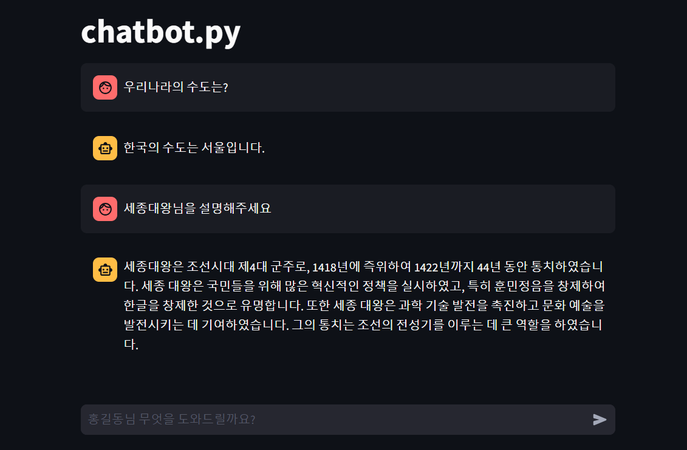
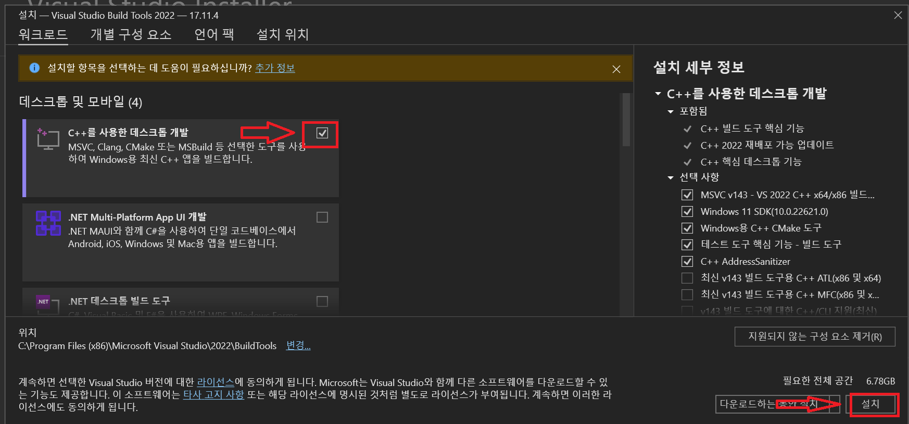
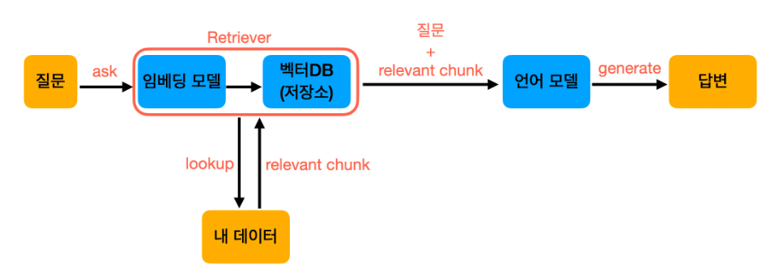

# [python-dotenv.py](https://daco2020.tistory.com/480)
- Python에서는 python-dotenv 라이브러리를 사용하여 환경변수를 쉽게 관리할 수 있다.

---
### 단계1: 설치
```shell
pip install python-dotenv
```
### 단계2: `.env`
- `.env` 파일에 환경변수 설정 
```shell
SECRET_ENV="코딩좋아^^"
```

---
### 단계3: python-dotenv.py
```python
import os
from dotenv import load_dotenv
import streamlit as st

load_dotenv()
SECRET_ENV = os.getenv("SECRET_ENV")

st.title(f"SECRET_ENV > {SECRET_ENV}")
```


---
### 단계4: streamlit 실행 
```shell
streamlit run python-dotenv.py
```


---
### 단계5: 결과 확인 


---
# [chat.py](https://github.com/cailynyongyong/solar-llm/blob/master/chat.py)
- LLM OpenAI를 이용하여 답변 구현 

---
### 단계1: 설치
```shell
pip install langchain-openai langchain langchain-community langchain-core
```
### 단계2: OPENAI_API_KEY 환경변수 설정 
- [OpenAI Key 발급방법](https://platform.openai.com/api-keys)
- [OpenAI 요금](https://openai.com/api/pricing/)
- `.env`를 이용하여 환경변수 설정
```shell
OPENAI_API_KEY="api 키 입력"
```

---
### 단계3: chat.py
```python
import streamlit as st
from dotenv import load_dotenv
load_dotenv()

from langchain_openai import ChatOpenAI
from langchain_core.messages import HumanMessage, SystemMessage

chat = ChatOpenAI()

messages = [
    SystemMessage(content="You are a helpful assistant."),
    HumanMessage(content="Hi, how are you?")
]
response = chat.invoke(messages)
print(response.content)
st.title(f"response > {response.content}")

```

---
### 단계4: streamlit 실행 
```shell
streamlit run chat.py
```


---
### 단계5: 결과 확인 


---


